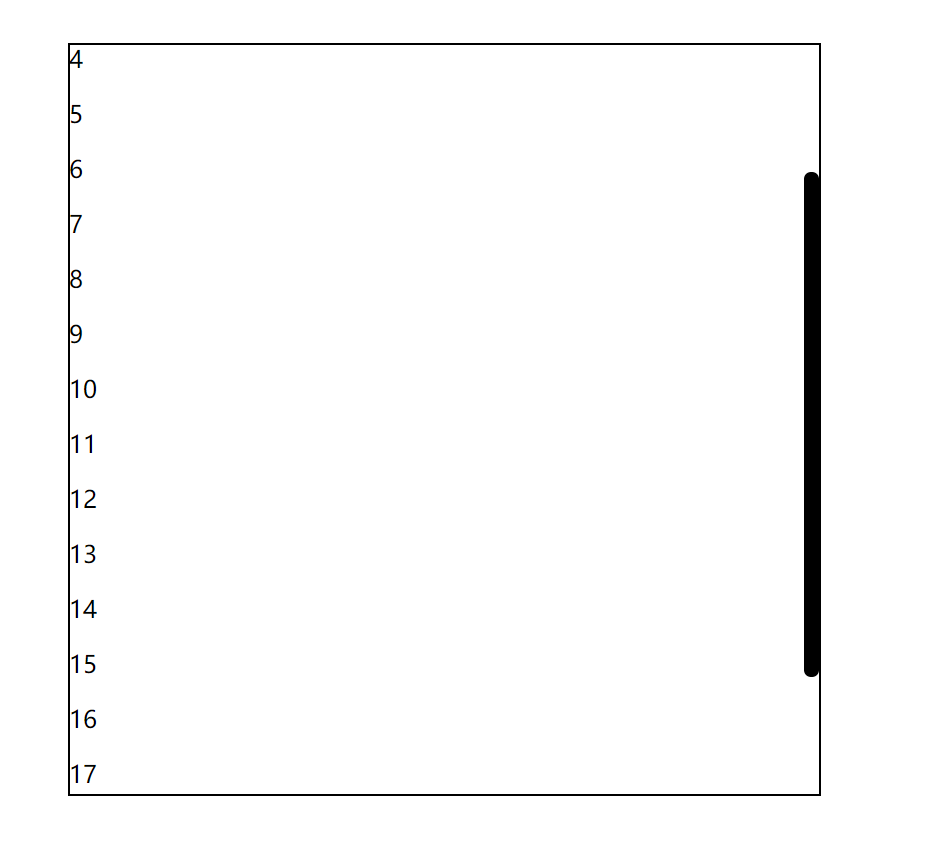

## [在线浏览](http://wuchuang222.gz01.bdysite.com/)
使用原生js实现的音乐播放器
## API接口
我使用的是酷狗的jsonp接口,经过我测试发现这三个接口可以用，我就用来写了这个播放器，

## 我封装的滚动条
基本使用方法
```
//html代码,main里只能有一个标签
<div class="main">
       <div>
           //内容
           <p>1<p/>......
       </div>
</div>
//引入滚动条
<script src="./scrollbar.js"></script>
//js代码
let bar = new ScrollBar({
    div : document.querySelector('.main'),
    bgColor : '#000'
})
bar.init()//初始化
```

效果图

